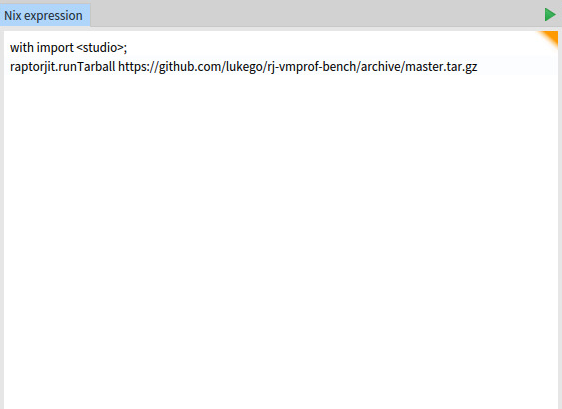
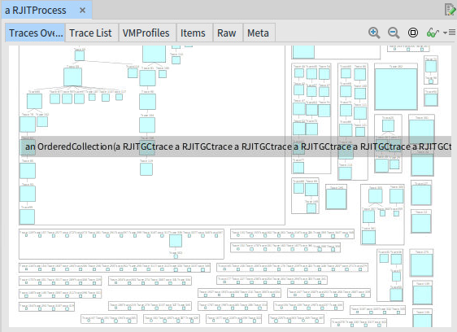
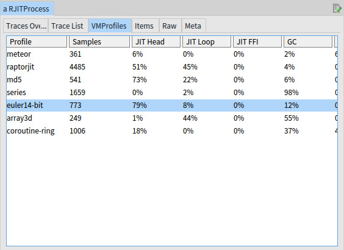
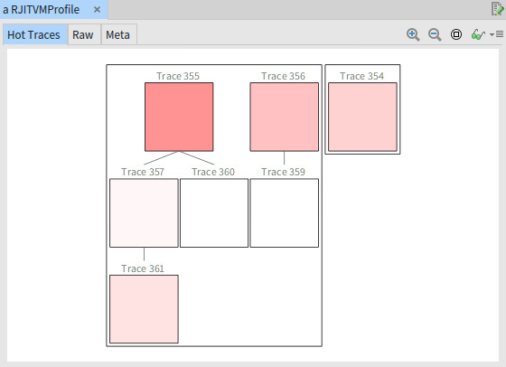

# Studio

Studio is a productive environment for working on your programs.

Think of Studio as the programmer's virtual counterpart to the artist
studio; the mechanic workshop; a doctor surgery. It is a workspace
that you can fill with the tools that help you do your work, where
they will all be within easy reach when you want them.

Studio is not a traditional software IDE. You don't write your source
code in Studio. What you do is collect specialist tools for the kind
of software you are working on. This could include profilers like
Intel VTune, protocol analyzers like Wireshark, testers like Valgrind,
and so on.

Studio is very new. The first applications being supported are
[RaptorJIT](https://github.com/raptorjit/raptorjit) and
[Snabb](https://github.com/snabbco/snabb). There is room for hundreds
more!

## Status

Studio is currently suitable for extreme-early-adopters who are
interested in experimenting with RaptorJIT code.

## Installation

Studio is a GUI application that runs on Linux/x86-64. The recommended
deployment method is to run Studio on a server and access it using
VNC. You can also run it locally on your development machine. (If want
to run locally on a Mac then you can create a Linux VM using Docker or
VirtualBox.)

#### Prerequisite: Nix

Studio is installed using the Nix package manager. So you need to
install Nix before installing Studio.

```
$ curl https://nixos.org/nix/install | sh
```

#### Installing for X11 GUI

The command `studio-gui` runs the Studio GUI directly via X11. You
need to have an X11 display server available. This is probably the
right choice if you are installing on a machine that has a graphical
desktop environment e.g. a Linux laptop or graphical VirtualBox VM.

Installation:

```
$ nix-env -i studio-gui -f https://github.com/studio/studio/archive/master.tar.gz
```

Running:

```
$ studio-gui
```

#### Installing for VNC GUI

The command `studio-gui-vnc` runs the Studio GUI behind a VNC remote
desktop server. You can connect to the GUI from another host using
your VNC client of choice. This is probably the right choice if you
are installing Studio on a server (bare metal or cloud VM) that you
will access remotely.

Installation:

```
$ nix-env -i studio-gui-vnc -f https://github.com/studio/studio/archive/master.tar.gz
```

Running:

```
$ studio-gui-vnc [vncserver--args...]
```

##### VNC Remote Access Tips

- The recommended VNC client is `tigervnc`. On MacOS with Homebrew you can install this with `brew cask install tigervnc-viewer`.
- Studio uses the `tigervnc` VNC server. The default behavior is to choose an available display number (specify with `:NUM` argument) and to run in the background (suppress with `-fg` argument).
- Using SSH:
    - Start a long-lived Studio session: `ssh <server> studio-gui-vnc`.
    - Setup SSH port forwarding to (e.g.) display 7: `ssh -L 5907:localhost:5907 <server>`.
    - Connect with VNC client to (e.g.) display 7 over SSH forwarded port: `vncviewer localhost:7`.

## Design

Studio is composed of two halves:

The **frontend** provides a graphical user interface based on
[Pharo](http://pharo.org/) using the "[moldable tools](http://scg.unibe.ch/news/2016-10-02_23-15-02Chis16d)" approach of the
[Glamorous Toolkit](http://gtoolkit.org/).

The **backend** produces data for the frontend using the flexibility of [Nix](http://nixos.org/nix/) to make use of practically any software in the universe.

### Using Studio

Studio opens to an "Inspector" window where you can enter a Nix expression and then evaluate by pressing the green arrow.



The result of your expression will be inspected in a new pane to the right:



You can click on individual objects to open them in new Inspector panes:






and you can backtrack to previous panes, or resize the number of panes that are visible at one time, using the controls at the bottom:


